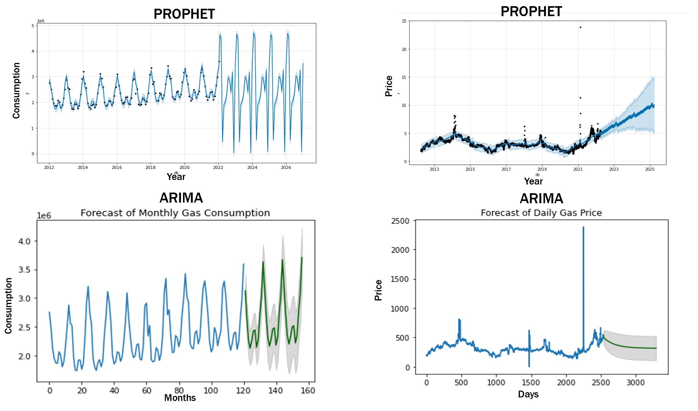

# Project2 - Natural Gas Forecasting/Scheduling

This machine learning model will help natural gas supplier/scheduler prepare for better inventory controls in future. Additionally, the machine learning tool can come up with automated forecasting models and allow one person to do the work of multiple data scientists.

---

## Project Overview

Using time series forecasting models, develop a machine learning model to forecast natural gas pricing and consumption based on 10 years of historical data. Further, develop a correlation table and and heatmap which contains the correlations between following variables: natural gas price, natural gas consumption, natural gas exports, storage and ambient temperature.                                                                                                               

The following two time series forecasting models were used: 1) Prophet 2) ARIMA

---

## Data Resources/Basis

#### Natural Gas Data:
- Price, Consumption, Storage, Exports
- U.S. Energy Information Administration (www.eia.gov)

#### USA Average Temperature Data:
- National Centers for Environmental Information (ncei.noaa.gov)

#### Historical Data:
- 10 Years (2012-2022)

#### Forecast Data:
- 3 Years

---

## Usage

Ensure the conda dev environment is activated.

Please launch jupyter lab to run files following files:

- ng_correlation.ipynb - Natural gas trends and correlations/heatmap
- arima_forecast.ipynb - Times Series Forecasting using ARIMA

Open Google Colab (https://colab.research.google.com/) and upload the following starter notebook:
- prophet_ngforecasting.ipynb - Times Series Forecasting using Prophet

All the csv files to run the models are located in the Resources folder.

---

## Identifying Patterns and Correlations/Heatmap

Before moving to time series forecasting analysis it is important to identify any seasonal/unusual patterns in time series data. The variations of natural gas (Henry Hub) spot prices, USA average temperature, USA gas consumption, USA working gas storage and LNG exports over time are shown below. Further a correlation matrix and heatmap were also developed. Valuable insights can be gained looking at this patterns. Natural gas prices and gas consumption show peaks during winter months and then go lower during summer months. Natural gas storage is at the peak during the start of winter and then starts decreasing as the winter progresses. No strong correlation exists between domestic consumption and HH spot price. Good positive correlation exists between domestic consumption and exports indicating that USA is exporting gas to the countries in northern hemisphere. This data will be used to teach time series models to incorporate them into their predictions.

### Natural Gas Spot and Futures Prices (NYMEX) - Daily

### Gas & Temperature Monthly Trends

### Heatmap

---

## Time Series Forecasting Analysis

Time series forecasting involves using a model that’s based on historical data to predict future values in the time series. Two models: 1) Prophet and 2) ARIMA were used. Detailed outputs of both models are available via the individual runs of the model files provided in the repository main path. A summary of the monthly gas consumption and daily prices forecasted from both models is shown below.

### Summary of Prophet and ARIMA forecasting models 

---

## Issues

Few modifications were made to original csv data files to make them work for the ARIMA code. Dates format converted to integer time series and named as daily and monthly. Cost unit is converted to cents from dollar (float to integer conversion).

---

## New Library

New library "ARIMA" was used. An ARIMA model is a class of statistical models for analyzing and forecasting time series data. ARIMA is short for "AutoRegressive Integrated Moving Average". Any ‘non-seasonal’ time series that exhibits patterns and is not a random white noise can be modeled with ARIMA models. If a time series, has seasonal patterns, then you need to add seasonal terms and it becomes SARIMA, short for ‘Seasonal ARIMA’. 

---

## Presentation

Please click on the following link to view the project presentation.
https://github.com/paragmb/Project2/blob/main/Presentation/FinTech_Project2_Grp3_Presentation.pdf

---

## Future Steps

Machine learning model for natural gas consumption can be updated monthly. Machine learning model for natural gas prices can be updated daily/weekly. Although Henry Hub (HH) spot prices were used in this time series forecasting analysis, an additional model using the domestic gas prices can also be developed. Impact of LNG exports in next 3 to 5 years can be further studied and incorporated in the natural gas forecasting scenarios. 

---

## Contributors

Bolaji Ajimotokan, Onur Guvener, Parag Borkar

---

© 2022 Trilogy Education Services, a 2U, Inc. brand. All Rights Reserved.
